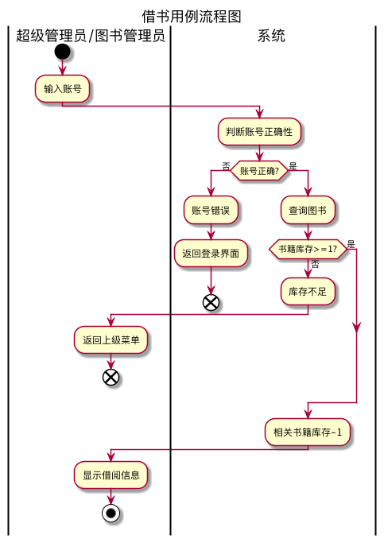
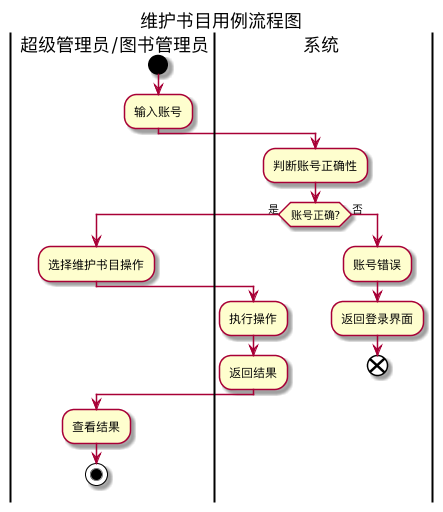

## 实验二（test2）：图书管理系统用例建模
|学号|班级|姓名|
|:---------------:|:------------:|:------------:|
|201610414105|软件16-1|兰迪|
### 1.图书管理系统整体的用例关系图
#### plantuml代码如下：
```@startuml
left to right direction
skinparam packageStyle rect
actor 图书管理员
actor 读者
actor 超级管理员
actor 游客
rectangle 图书馆系统 {
    超级管理员 -|> 图书管理员
    超级管理员 -->(维护图书管理员信息)
    图书管理员 --> (借出图书)
    图书管理员 --> (归还图书)
    图书管理员 --> (维护书目)
    图书管理员 --> (维护读者信息)
    (图书查询) <-- 读者
    (预定图书) .->(图书查询):<<include>>
    (查询借阅情况) <--读者
    (账户设置) <--读者
    (预定图书) <--读者
    (取消预定) <--读者
    (图书查询) <--游客
    (归还图书) .-> (登记赔偿):<<extend>>
    (预定图书) .->(取消预定):<<extend>>
  }
@enduml
```
#### 用例关系图如下：


### 2.参与者说明:
#### 超级管理员
     主要职责:维护图书管理员的身份信息，并拥有图书管理员所有功能。
     特点:必须登录
#### 图书管理员
     主要职责:维护图书，读者信息，负责图书的借还。
     特点:必须登录
#### 读者
     主要职责:查询图书，借阅信息，具有预订和取消预订图书功能。
     特点:必须登录
#### 游客:
     主要职责:只具有查询图书的功能。
     特点:不用登录

### 3.用例的规约表
#### 3.1“图书查询”用例
#### 3.1.1 “图书查询”用例规约
|用例名称|图书查询|
|:-|:-|
|参与者|游客/读者|
|前置条件|<ul><li>进入系统</li><li>网络状态良好</li></ul>|
|后置条件|页面成功显示书籍内容|
|主事件流|
|参与者动作|系统行为|
|1.参与者查询所需书籍关键字<br><br><br>4.根据页面内容进行下一步操作|<br>2.系统根据关键字从数据库查询数据<br>3.将查询结果格式化输出到页面|
|备选事件流|
|1a.书籍不存在<br><ul>1.系统提示书籍不存在,用例结束</ul>2a.关键字非法<br><ul>2.系统提示关键字非法,返回事件流开头</ul>|
|业务规则|
|<ol><li>所有用户都可进行该项操作</li><li>根据用户角色判断是否可以进行进一步操作</li><li>一次只能查询一本书</li></ol>|
#### 3.1.2“图书查询”用例流程图代码
```@startuml
title:图书查询流程图
|游客/读者|
start
	:输入查询条件;
	|系统|
if(图书信息不存在?) then (存在)
	:返回图书信息;
else 
	:返回图书不存在;
endif
:返回信息;
|游客/读者|
:查看返回结果;
stop
@enduml
```
#### 3.1.3“图书查询”用例流程图如下

#### 3.2“账户设置”用例
#### 3.2.1 “账户设置”用例规约
|用例名称|账户设置|
|:-|:-|
|参与者|读者/图书馆管理员/超级管理员|
|前置条件|<ul><li>成功登录</li><li>进入个人信息界面</li></ul>|
|后置条件|<ul><li>页面能够显示登录用户的详细信息</li><li>对参与者的动作做出相应的反应</li></ul>|
|主事件流|
|参与者动作|系统行为|
|1.输入账号<br><br>3.参与者根据需求对个人信息进行修改|<br>2.判断账户合法性<br><br>4.系统根据用户操作后保存更新信息|
|备选事件流|
|1a.系统反应错误<br><ul>1.系统提示修改失败，用例结束</ul>2a.输入字符非法<br><ul>2.系统提示字符非法,返回事件流开头</ul>|
|业务规则|
|<ol><li>必须登录才能修改个人信息</li><li>用户根据角色差别显示的内容也有所不同</li><li>基本信息如：专业，学员，学号不能修改</li></ol>|
#### 3.2.2“账户设置”用例流程图代码
```@startuml
title:账户设置流程图
|读者/图书管理员/超级管理员|
start
	:输入账号;
	|系统|
    :判断账号合法性;
if(账号合法?) then (是)
	:进入个人信息;
    |读者/图书管理员/超级管理员|
	:修改个人信息;
	:保存更新信息;
else(否)
    |系统|
	:账号错误;
	:返回登录界面;
	end
endif
:修改信息成功;
|读者/图书管理员/超级管理员|
:查看更新信息结果;
stop
@enduml
```
#### 3.2.3“账户设置”用例流程图如下

#### 3.3“借出图书”用例
#### 3.3.1“借出图书”用例规约
|用例名称|借出图书|
|:-|:-|
|参与者|图书馆管理员/超级管理员|
|前置条件|<ul><li>成功登录</li><li>查询所得的书籍属性中,库存数量大于等于1</li></ul>|
|后置条件|<ul><li>书籍库存-1;生成借书单</li></ul>|
|主事件流|
|参与者动作|系统行为|
|1.输入账号<br>3.输入借出账号<br>8.查看结果|<br>2.判断账号合法性<br>4.判断账号是否合法<br>5.判断图书库存<br>6.借出图书<br>7.修改库存<br>|
|备选事件流|
|1a.账号不合法<br><ul>1.系统提示账号错误，用例结束</ul>2a.库存不足<ul>2.系统提示库存不足，用例结束</ul>|
|业务规则|
|<ol><li>必须登录才能进行操作</li><li>书籍库存不能少于0</li></ol>|
#### 3.3.2“借出图书”用例流程图代码
```@startuml 
title:借书用例流程图
|超级管理员/图书管理员|
start
:输入账号;
	|系统|
    :判断账号合法性;
if(账号合法?) then (否)
|系统|
:账号错误;
:返回登录界面;
end
else(是)
:查询图书;
|系统|
if (书籍库存>=1?) then(否)
:库存不足;
|超级管理员/图书管理员|
:返回上级菜单;
end
else(是)
endif
|系统|
:相关书籍库存-1;
|超级管理员/图书管理员|
:显示借阅信息;
stop
@enduml
```
#### 3.3.3“借出图书”用例流程图如下

#### 3.4“归还图书”用例
#### 3.4.1“归还图书”用例规约
|用例名称|归还图书|
|:-|:-|
|参与者|图书馆管理员/超级管理员|
|前置条件|<ul><li>成功登录</li><li>书籍处于'借出'状态</li><li>书籍完好归还</li></ul>|
|后置条件|<ul><li>书籍库存+1,更新借书单状态为'归还'</li></ul>|
|主事件流|
|参与者动作|系统行为|
|1.输入账号<br>3.输入归还账号<br>9.查看结果|2.判断账号合法性<br>4.判断账号是否合法<br>5.判断用户是否借入图书<br>6.检查书籍是否完整<br>7.归还图书<br>8.修改库存<br>|
|备选事件流|
|1a.账号不合法<br><ul>1.系统提示账号错误，用例结束</ul>2a.用户未借图书<ul>2.系统提示用户未借图书，用例结束</ul>3a.书籍毁坏或遗失<br><ul>1.按照条例进行赔偿,本用例结束,进入登记赔偿用例</ul>4a.书籍逾期归还<br><ul>1.按照条例进行赔偿,本用例结束,进入登记赔偿用例</ul>|
|业务规则|
|<ol><li>必须登录才能进行操作</li><li>借阅者还书日期必须在规定时间内完成</li><li>书籍不得有损毁或遗失,否则根据相关条例进行处罚</li></ol>|
#### 3.4.2“归还图书”用例流程图代码
```@startuml
title:还书用例流程图
|超级管理员/图书管理员|
start
:输入账号;
	|系统|
    :判断账号合法性;
if(账号合法?) then (是)
|超级管理员/图书管理员|
repeat
	:输入归还账号;
	|系统|
	:判断账号合法性;
repeat while (输入合法?)
    |系统|
    if (账号是否借阅该书) then (是)
	    if(书籍是否破损或丢失) then (是)
	      :[登记赔偿];
		  detach
		  else(否)
		  :归还图书;
        endif
	        if(书籍是否逾期归还) then (是)
	          :[登记赔偿];
			  detach
	          else(否)
	          :归还图书;
			  :修改库存;
              |超级管理员/图书管理员|
              :查看结果;
              stop
		    endif
    else (未借阅)
	 |系统|
     :返回用户未借，中止还书;
	 detach
     endif
else(否)
|系统|
:账号错误;
:返回登录界面;
end
endif
@enduml
```
#### 3.4.3“归还图书”用例流程图如下

#### 3.5“预定图书”用例
#### 3.5.1“预定图书”用例规约
|用例名称|预定图书|
|:-|:-|
|参与者|读者|
|前置条件|<ul><li>成功登录</li></ul>|
|后置条件|<ul><li>预定图书成功</li></ul>|
|主事件流|
|参与者动作|系统行为|
|1.输入账号<br><br><br>4.预定成功<br>|<br>2.判断账号合法性<br>3.系统确认该书目库存是否大于等于1|
|备选事件流|
|1a.账号不合法<br><ul>1.系统提示账号错误，用例结束</ul>2a.库存不足<ul>2.系统提示库存不足，用例结束</ul>|
|业务规则|
|<ol><li>必须登录才能进行操作</li><li>系统允许多个读者同时预订图书，并根据库存对应返回是否成功</li><li>读者只能对有库存的图书进行预定</li><li>一名读者只能预定不超过10本书籍</li></ol>|
#### 3.5.2“预定图书”用例流程图代码
```
@startuml
title:预定图书用例流程图
|读者|
start
:输入账号;
	|系统|
    :判断账号合法性;
if(账号合法?) then (否)
|系统|
:账号错误;
:返回登录界面;
end
else(是)
if(库存不足?) then (不足)
	:库存不足，中止预订;
	detach
else
	:库存减一;
:返回预订信息;
|读者|
:预订成功;
stop
@enduml
```
#### 3.5.3“预定图书”用例流程图如下

#### 3.6“取消预定”用例
#### 3.6.1“取消预定”用例规约
|用例名称|取消预定|
|:-|:-|
|参与者|读者|
|前置条件|<ul><li>成功登录</li></ul>|
|后置条件|<ul><li>取消预定图书成功</li></ul>|
|主事件流|
|参与者动作|系统行为|
|1.参与者输入账号<br><br>3.取消预定操作<br><br>5.取消预订成功|<br>2.判断账号合法性<br><br>4.系统修改库存<br>|
|备选事件流|
|1a.账号不合法<br><ul>1.系统提示账号错误，用例结束</ul>|
|业务规则|
|<ol><li>必须登录才能进行操作</li><li>系统允许多个读者同时取消预订图书，并根据库存对应返回是否成功</li><li>读者只能取消已预定的图书</li></ol>|
#### 3.6.2“取消预定”用例流程图代码
```@startuml
title:取消预定用例流程图
|读者|
start
:输入账号;
	|系统|
    :判断账号合法性;
if(账号合法?) then (是)
:库存加一;
:返回取消预订信息;
|读者|
:取消预订成功;
stop
else(否)
|系统|
:账号错误;
:返回登录界面;
end
@enduml
```
#### 3.6.3“取消预定”用例流程图如下

#### 3.7“查询借阅书籍”用例
#### 3.7.1“查询借阅书籍”用例规约
|用例名称|查询借阅图书|
|:-|:-|
|参与者|读者|
|前置条件|<ul><li>成功登录</li></ul>|
|后置条件|<ul><li>查询到借阅情况</li></ul>|
|主事件流|
|参与者动作|系统行为|
|1.输入账号<br><br>3.进行查询<br><br>|<br>2.判断账号合法性<br><br>4.返回查询信息|
|备选事件流|
|1a.账号不合法<br><ul>1.系统提示账号错误，用例结束</ul>|
|业务规则|
|<ol><li>必须登录才能进行操作</li><li>系统允许多个读者同时查询借阅信息，并进行返回</li><li>读者只能查询自己的借阅信息</li></ol>|
#### 3.7.2“查询借阅书籍”用例流程图代码
@startuml
title:查询借阅用例流程图
|读者|
start
:输入账号;
	|系统|
    :判断账号合法性;
if(账号合法?) then (是)
:返回借阅信息;
|读者|
:查看借阅信息;
stop
else(否)
|系统|
:账号错误;
:返回登录界面;
end
@enduml
#### 3.7.3“查询借阅书籍”用例流程图如下

#### 3.8“登记赔偿”用例
#### 3.8.1“登记赔偿”用例规约
|用例名称|登记赔偿|
|:-|:-|
|参与者|图书管理员/超级管理员/读者|
|前置条件|<ul><li>读者出现违规行为</li></ul>|
|后置条件|<ul><li>使读者进行对应的登记补偿，记录读者的违规行为</li></ul>|
|主事件流|
|参与者动作|系统行为|
|1.判断读者的违规情况，查询相关规定进行登记赔偿|<br>2.响应图书管理员操作,添加违规记录|
|备选事件流|
|1a.账号不合法<br><ul>1.系统提示账号错误，用例结束</ul>|
|业务规则|
|<ol><li>必须登录才能进行操作</li></ol>|
#### 3.8.2“登记赔偿”用例流程图代码
```
@startuml
title:登记赔偿用例流程图
|图书管理员/超级管理员|
start
:输入账号;
|系统|
:判断账号合法性;
if(账号合法?) then (是)
|图书管理员/超级管理员|
:查询读者借阅信息;
   |系统|
   fork
   :书籍逾期;
   :赔偿=逾期时间*1;
   fork again
   :书籍毁坏;
   :原价赔偿书本;
   fork end
   |图书管理员/超级管理员|
   :返回赔偿结果;
   |读者|
   :进行赔偿;
   |系统|
   :消除借阅违规记录;
   stop
else(否)
|系统|
:账号错误;
:返回登录界面;
end
@enduml
```
#### 3.8.3“登记赔偿”用例流程图如下

#### 3.9“维护读者信息”用例
#### 3.9.1“维护读者信息”用例规约
|用例名称|维护读者信息|
|:-|:-|
|参与者|超级管理员/图书管理员|
|前置条件|<ul><li>登录账号</li></ul>|
|后置条件|<ul><li>维护读者信息成功</li></ul>|
|主事件流|
|参与者动作|系统行为|
|1.输入账号<br>3.进行维护<br>5.查看结果|2.判断账号合法性<br>4.结果|
|备选事件流|
|1a.账号不合法<br><ul>1.系统提示账号错误，用例结束</ul>|
|业务规则|
|<ol><li>必须登录才能进行操作</li><li>只有管理员才能进行维护读者信息操作</li></ol>|
#### 3.9.2“维护读者信息”用例流程图代码
```
@startuml
title:维护读者信息流程图
|超级管理员/图书管理员|
start
:输入账号;
	|系统|
    :判断账号合法性;
if(账号合法?) then (是)
|超级管理员/图书管理员|
:选择维护读者信息操作;
|系统|
:执行操作;
:返回结果;
|超级管理员/图书管理员|
:查看结果;
stop
else(否)
|系统|
:账号错误;
:返回登录界面;
end
@enduml
```
#### 3.9.3“维护读者信息”用例流程图如下

#### 3.10“维护图书管理员信息”用例
#### 3.10.1“维护图书管理员信息”用例规约
|用例名称|维护图书管理员信息|
|:-|:-|
|参与者|超级管理员|
|前置条件|<ul><li>登录超级管理员账号</li></ul>|
|后置条件|<ul><li>维护图书管理员信息成功</li></ul>|
|主事件流|
|参与者动作|系统行为|
|1.输入账号<br>3.进行维护<br>5.查看结果|2.判断账号合法性<br>4.结果|
|备选事件流|
|1a.账号不合法<br><ul>1.系统提示账号错误，用例结束</ul>|
|业务规则|
|<ol><li>必须登录才能进行操作</li><li>只有超级管理员才能进行维护图书管理员操作</li></ol>|
#### 3.10.2“维护图书管理员信息”用例流程图代码
```
@startuml
title:维护图书管理员信息流程图
|超级管理员|
start
:输入账号;
	|系统|
    :判断账号合法性;
if(账号合法?) then (是)
|超级管理员|
:选择维护图书管理员操作;
|系统|
:执行操作;
:返回结果;
|超级管理员|
:查看结果;
stop
else(否)
|系统|
:账号错误;
:返回登录界面;
end
@enduml
```
#### 3.10.3“维护图书管理员信息”用例流程图如下

#### 3.11“维护书目”用例
#### 3.11.1“维护书目”用例规约
|用例名称|维护书目|
|:-|:-|
|参与者|超级管理员/图书管理员|
|前置条件|<ul><li>登录账号</li></ul>|
|后置条件|<ul><li>维护书目成功</li></ul>|
|主事件流|
|参与者动作|系统行为|
|1.输入账号<br>3.进行维护<br>5.查看结果|2.判断账号合法性<br>4.结果|
|备选事件流|
|1a.账号不合法<br><ul>1.系统提示账号错误，用例结束</ul>|
|业务规则|
|<ol><li>必须登录才能进行操作</li><li>只有管理员才能进行维护数目操作</li></ol>|
#### 3.11.2“维护书目”用例流程图代码
```
@startuml
title:维护书目用例流程图
|超级管理员/图书管理员|
start
:输入账号;
	|系统|
    :判断账号合法性;
if(账号合法?) then (是)
|超级管理员/图书管理员|
:选择维护书目操作;
|系统|
:执行操作;
:返回结果;
|超级管理员/图书管理员|
:查看结果;
stop
else(否)
|系统|
:账号错误;
:返回登录界面;
end
@enduml
```
#### 3.11.3“维护书目”用例流程图如下



