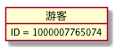
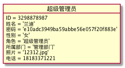
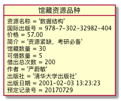
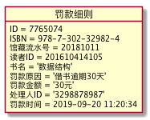

## 实验三（test3）：图书管理系统领域对象建模
|学号|班级|姓名|
|:---------------:|:------------:|:------------:|
|201610414105|软件16-1|兰迪|
### 1.图书管理系统类图
#### 1.1plantuml代码如下
```
@startuml
left to right direction
class 游客{
    ID
}
class 用户{
    ID
    姓名
    性别
    密码
    角色
    电话
    邮箱
    照片
    电话
    --set 和 get--
    ...
    --
    End of class

}
class 图书管理员 {
    所属部门
    --set 和 get--
    ...
    --
    End of class
}
class 超级管理员{
    所属部门
    --set 和 get--
    ...
    --
    End of class
}

class 读者 {
    出生日期
    所属学院
    专业
    借书数量
    --set 和 get--
    ...
    --
    End of class
}

class 图书品种{
    ID
    ISBN
    书名
    语言
    种类
    出版日期
    --get 和 set--
    ...
    --
    End of class
}
class 图书{
    ID
    ISBN
    书名
    出版社
    作者
    价格
    馆藏数量
    可借数量
    借出总次数
    内容简介
    照片
    --set和get--
    ...
    --
    End of class
}

class 借书记录{
    ID
    ISBN
    图书ID
    读者ID
    书名
    借书日期
    归还日期
    借书时长
    是否归还
    是否逾期
    --set和get--
    ...
    --
    End of class
}

class 预定记录{
    ID
    ISBN
    图书ID
    读者ID
    书名
    预定日期
    取书日期
    是否超期未取
    是否取消预定
    --set和get--
    ...
    --
    End of class
}

class 逾期记录{
    ID
    ISBN
    图书ID
    读者ID
    书名
    逾期日期
    归还日期
    逾期时长
    备注
    --set和get--
    ...
    --
    End of class
}

class 罚款细则{
    ID
    读者ID
    图书ID
    书名
    罚款原因
    罚款金额
    处理人ID
    罚款时间
    --set和get--
    ...
    --
    End of class
}

用户 <|-left- 读者
用户 <|-down- 图书管理员
用户 <|-left- 超级管理员

图书管理员 "1..10"-up-"1" 超级管理员:维护
超级管理员 "1"-up- "n"读者 :维护
图书管理员 "1"-right-"n"借书记录:登记
图书管理员 "1"-down-"n"逾期记录:登记
图书管理员 "1"-down-"n"罚款细则:登记
读者 "1"-right-"n"预定记录:查询
读者 "1"-down- "n"借书记录:查询
读者 "1"-left- "0..1"逾期记录:查询
读者 "1"-right- "n"图书:查询或借阅
游客 "1"-left- "n"图书:查询
图书品种 "1"*-right- "n"图书:馆藏
图书 "1"-down- "n"预定记录
图书 "1"-right- "n"借书记录
逾期记录 "0..1"-down-"0..1"罚款细则:使用
@enduml
```
#### 1.2类图如下

#### 1.3类图说明
##### 1.管理员分别有图书管理员和超级管理员，超级管理员可以维护图书管理员和读者，图书管理员维护读者。参考实验二用例关系图的三个角色，维护图书管理员信息用例，维护读者信息用例。
##### 2.读者可以对逾期记录，借书记录，预定记录进行查询，对个人账户进行修改，并且具有预定书籍和取消预定功能，而管理员则可以实际的进行借书还书等相应操作。参考实验二借出图书，归还图书，维护书目，预定图书，取消预定，账户设置，图书查询的用例。
##### 3.逾期记录对罚款细则进行使用，图书按图书品种进行馆藏。参考实验二登记赔偿的用例。

### 2.对象图
#### 2.1类“游客”的对象图
#### 2.1.1类“游客”的对象图代码如下
```
@startuml
object 游客{
    ID = 1000007765074

 }
@enduml
```
#### 2.1.2类“游客”的对象图如下

#### 2.2类“读者”的对象图
#### 2.2.1类“读者”的对象图代码如下
```
@startuml

object 读者{
    ID = 201610414105
    姓名 = '兰迪'
    密码 = 'e10adc3949ba59abbe56e057f20f883e'
    性别 = '女'
    出生日期 = '1997-09-16'
    角色 = '读者'
    所属学院 = '信息科学与工程学院'
    专业 = '软件工程'
    借书数量 = 10
    照片 = '12312.jpg'
    邮箱 = '949103298@qq.com'
    电话 = 18183371221

}
@enduml
```

#### 2.2.2类“读者”的对象图如下

#### 2.3类“图书管理员”的对象图
#### 2.3.1类“图书管理员”的对象图代码如下
```
@startuml
object 图书管理员{
    ID = 3298878987
    姓名 = '兰迪'
    密码 = 'e10adc3949ba59abbe56e057f20f883e'
    性别 = '女'
    角色 = '图书管理员'
    所属部门 = '行政部门'
    照片 = '12312.jpg'
    邮箱 = '949103297@qq.com'
    电话 = 18183371221
}
@enduml
```
#### 2.3.2类“图书管理员”的对象图如下

#### 2.4类“超级管理员”的对象图
#### 2.4.1类“超级管理员”的对象图代码如下
```
@startuml
object 超级管理员{
    ID = 3298878987
    姓名 = '兰迪'
    密码 = 'e10adc3949ba59abbe56e057f20f883e'
    性别 = '女'
    角色 = '超级管理员'
    所属部门 = '管理部门'
    照片 = '12312.jpg'
    电话 = 18183371221
}
@enduml
```
#### 2.4.2类“超级管理员”的对象图如下

#### 2.5类“图书”的对象图
#### 2.5.1类“图书”的对象图代码如下
```
@startuml

object 图书{
    ISBN = 978-7-302-32982-4
    书名 = '数据结构'
    出版社 = '清华大学出版社'
    作者 = '严蔚敏'
    价格 = 57.00
    馆藏数量 = 30
    可借数量 = 5
    借出总次数 = 200
    内容简介 = '关于数据的奥秘'
    照片 = 'data.jpg'
}

@enduml
```
#### 2.5.2类“图书”的对象图如下

#### 2.6类“图书”的对象图
#### 2.6.1类“图书”的对象图代码如下
```
@startuml

object 图书品种{
    ID = 111111
    ISBN= 978-7-302-32982-4
    书名 = '数据结构'
    语言 = '中文'
    种类 = '计算机类'
    出版日期= 2001-03-04 13:21:23

 }

@enduml
```
#### 2.6.2类“图书”的对象图如下

#### 2.7类“借书记录”的对象图
#### 2.7.1类“借书记录”的对象图代码如下
```
@startuml

object 借书记录{
    ID = 986754633
    ISBN = 978-7-302-32982-4
    读者 = 201610414105
    书名 = '数据结构'
    借书日期 = 2017-08-19 12:22:12
    归还日期 = 2018-09-19 09:22:12
    借书时长 = '一年一个月'
    是否归还 = '是'
    是否逾期 = '是'

 }

@enduml
```
#### 2.7.2类“借书记录”的对象图如下

#### 2.8类“预定记录”的对象图
#### 2.8.1类“预定记录”的对象图代码如下
```
@startuml

object 预定记录{
    ID = 986754633
    ISBN = 978-7-302-32982-4
    读者ID = 201610414105
    图书ID = 111111
    书名 = '数据结构'
    预定日期 = '2018-09-22 13:21:21'
    取书日期 = '2018-11-22 15:23:12'
    是否超期未取 = '否'
    是否取消预定 = '否' 

 }

@enduml
```
#### 2.8.2类“预定记录”的对象图如下

#### 2.9类“逾期记录”的对象图
#### 2.9.1类“逾期记录”的对象图代码如下
```
@startuml

object 逾期记录{
    ID = 77656754
    ISBN = 978-7-302-32982-4
    读者ID = 201610414105
    图书ID = 111111
    书名 = '数据结构'
    逾期日期 = 2017-08-19 11:22:11
    归还日期 = 2017-09-19 13:24:31 
    逾期时长 = '30天'
    备注 = '无'


 }

@enduml
```
#### 2.9.2类“逾期记录”的对象图如下

#### 2.10类“逾期记录”的对象图
#### 2.10.1类“逾期记录”的对象图代码如下
```
@startuml

object 罚款细则{
    ID = 7765074
    ISBN = 978-7-302-32982-4
    读者ID = 201610414105
    图书ID = 111111
    书名 = '数据结构'
    罚款原因 = '借书逾期30天'
    罚款金额 = '30元' 
    处理人ID = '3298878987'
    罚款时间 = 2019-09-20 11:20:34
    

 }

@enduml
```
#### 2.10.2类“逾期记录”的对象图如下



