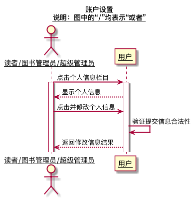
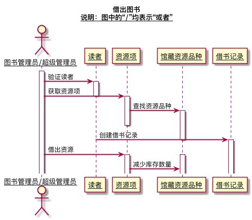
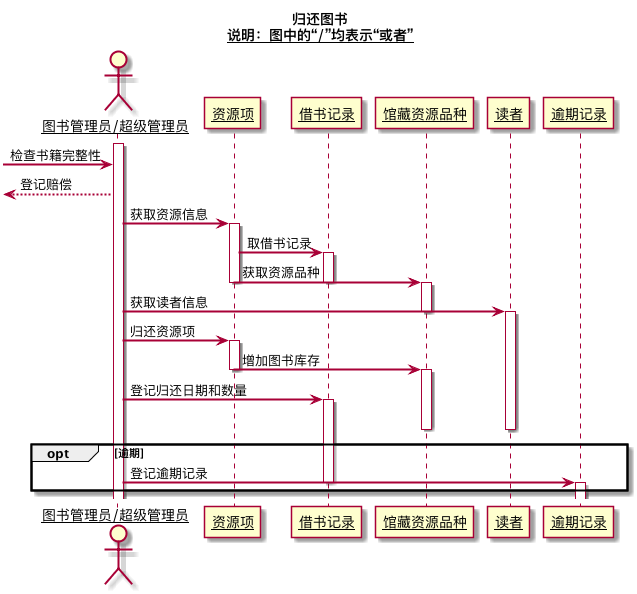
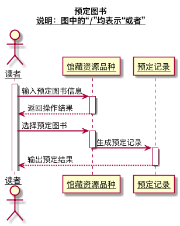
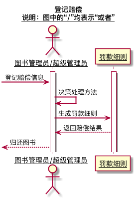
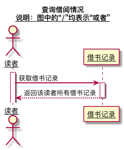

## 实验四（test4）：图书管理系统顺序图绘制
|学号|班级|姓名|
|:---------------:|:------------:|:------------:|
|201610414105|软件16-1|兰迪|
### 1.图书查询
#### 1.1图书查询的PlantUML代码
```
@startuml
title
 图书查询
 <u>说明：图中的“/”均表示“或者”</u>
end title
skinparam sequenceArrowThickness 2
skinparam maxmessagesize 60
skinparam sequenceParticipant underline
actor "用户" as U
participant "图书" as A
U ->A:输入图书信息
activate A
A -->U:返回图书信息
@enduml
```
#### 1.2图书查询顺序图

#### 1.3图书查询顺序图说明
1.参与者:actor:图书管理员/游客/超级管理员/读者 participant:图书<br>
2.消息：输入图书信息 -> 返回图书信息<br>

### 2.账户设置
#### 2.1账户查询的PlantUML代码
```
@startuml
title
 账户设置
 <u>说明：图中的“/”均表示“或者”</u>
end title
skinparam sequenceArrowThickness 2
skinparam maxmessagesize 60
skinparam sequenceParticipant underline
actor "读者/图书管理员/超级管理员" as U
participant "用户" as A
U ->A:点击个人信息栏目
activate A
A -->U:显示个人信息
U ->A:点击并修改个人信息
A ->A:验证提交信息合法性
A -->U:返回修改信息结果
@enduml
```
#### 2.2账户设置顺序图


#### 1.3账户设置顺序图说明
1.参与者：actor：图书管理员/超级管理员/读者 participant:用户 <br>
2.消息 点击个人信息栏目 -> 显示个人信息 -> 点击并修改个人信息 -> 验证提交信息合法性 -> 返回更新结果<br>

### 3.借出图书
#### 3.1借出图书的PlantUML代码
```
@startuml
title
 借出图书
 <u>说明：图中的“/”均表示“或者”</u>
end title
skinparam sequenceArrowThickness 2
skinparam maxmessagesize 60
skinparam sequenceParticipant underline
actor "图书管理员/超级管理员" as U
participant "读者" as A
participant "资源项" as B
participant "馆藏资源品种" as C
participant "借书记录" as D
U ->A:验证读者
activate A
U ->B:获取资源项
deactivate A
activate B
B ->C:查找资源品种
activate C
deactivate B
A ->D:创建借书记录
deactivate C
activate D
U ->B:借出资源
activate B
activate C
B ->C:减少库存数量
@enduml
```
#### 3.2借出图书顺序图


#### 3.3借出图书顺序图说明
1.参与者：actor：图书管理员/超级管理员 participant:读者，资源项，馆藏资源品种，借书记录<br>
2.消息 验证读者 -> 获取资源项 -> 查找资源品种 -> 创建借书记录 -> 借出资源 ->  减少库存数量 <br>

### 4.归还图书
#### 4.1归还图书的PlantUML代码
```
@startuml
title
 归还图书
 <u>说明：图中的“/”均表示“或者”</u>
end title
skinparam sequenceArrowThickness 2
skinparam maxmessagesize 60
skinparam sequenceParticipant underline
actor "图书管理员/超级管理员" as U
participant "资源项" as A
participant "借书记录" as B
participant "馆藏资源品种" as C
participant "读者" as D
participant "逾期记录" as E
activate U

-> U:检查书籍完整性
<-- U:登记赔偿

U ->A:获取资源信息
activate A
A ->B:取借书记录

activate B
A ->C:获取资源品种
deactivate A
deactivate B

activate C
U ->D:获取读者信息
deactivate C
activate D

U ->A:归还资源项
activate A

A ->C:增加图书库存
deactivate A

activate C
U ->B:登记归还日期和数量
activate B
deactivate C
deactivate D
opt 逾期
   U ->E:登记逾期记录
   deactivate B
   activate E
end
@enduml
@enduml
```
#### 4.2归还图书顺序图


#### 4.3归还图书顺序图说明
1.参与者：actor：图书管理员/超级管理员 participant:资源项，借书记录，馆藏资源品种，读者，逾期记录<br>
2.消息 检查书籍完整性(如果书籍有破损，则进入登记赔偿) -> 获取资源信息 -> 取借书记录 -> 获取资源品种 -> 获取读者信息 -> 归还资源项 -> 增加图书库存 ->登记归还日期和数量 -> 登记逾期记录<br>

### 5.预定图书
#### 5.1预定图书的PlantUML代码
```
@startuml
title
 预定图书
 <u>说明：图中的“/”均表示“或者”</u>
end title
skinparam sequenceArrowThickness 2
skinparam maxmessagesize 60
skinparam sequenceParticipant underline

actor 读者
participant "馆藏资源品种" as A
participant "预定记录" as B

activate 读者
读者 ->A:输入预定图书信息
activate A

A -->读者:返回操作结果
deactivate A

读者 ->A:选择预定图书
activate A

A ->B:生成预定记录
deactivate A
activate B

B -->读者:输出预定结果
deactivate B

@enduml

@enduml
```
#### 5.2预定图书顺序图


#### 5.3预定图书顺序图说明
1.参与者：actor：读者 participant:馆藏资源品种，预定记录<br>
2.消息 输入预定图书信息 -> 返回操作结果 -> 选择预定图书 -> 生成预定记录 -> 输出预定结果<br>

### 6.取消预定
#### 6.1预定图书的PlantUML代码
```
@startuml
title
 取消预定
 <u>说明：图中的“/”均表示“或者”</u>
end title
skinparam sequenceArrowThickness 2
skinparam maxmessagesize 60
skinparam sequenceParticipant underline
actor 读者
participant "预定记录" as B
activate 读者 
读者 ->B:取预定记录
activate B
B -->读者:返回该读者所有预定信息
deactivate B
读者 ->B:取消预定（删除预定记录）
activate B
B -->读者:返回操作结果
deactivate B
@enduml
```
#### 6.2取消预定顺序图


#### 6.3预定图书顺序图说明
1.参与者：actor：读者 participant:预定记录<br>
2.消息 取预定记录 -> 返回该读者所有预定记录 —> 取消预定（删除预定记录） -> 返回操作结果 <br>

### 7.登记赔偿
#### 7.1登记赔偿的PlantUML代码
```
@startuml
title
 登记赔偿
 <u>说明：图中的“/”均表示“或者”</u>
end title
skinparam sequenceArrowThickness 2
skinparam maxmessagesize 60
skinparam sequenceParticipant underline
actor "图书管理员/超级管理员" as U
participant "罚款细则" as A
activate U
activate A
-> U:登记赔偿信息
U ->U:决策处理方法
U ->A:生成罚款细则
A -->U:返回赔偿结果
<-- U:归还图书
@enduml
```
#### 7.2登记赔偿顺序图


#### 7.3登记赔偿顺序图说明
1.参与者：actor：图书管理员/超级管理员 participant:罚款细则<br>
2.消息 登记赔偿信息 -> 决策处理方法 -> 生成罚款细则 -> 返回赔偿结果 ->
归还图书<br>

### 8.维护书目
#### 8.1维护书目的PlantUML代码
```
@startuml
title
 维护书目
 <u>说明：图中的“/”均表示“或者”</u>
end title
skinparam sequenceArrowThickness 2
skinparam maxmessagesize 60
skinparam sequenceParticipant underline
actor "图书管理员/超级管理员" as U
participant "馆藏资源品种" as A
participant "图书" as B
U ->A:输入所要查询/添加/修改/删除的书目信息
activate A
A ->A:查询/添加/修改/删除书目
A -->U:提示“查询/添加/修改/删除成功”
deactivate A
U ->B:对应查询/添加/修改/删除图书
activate B
B -->U:提示“查询/添加/修改/删除成功”
deactivate B
@enduml
```
#### 8.2维护书目顺序图


#### 8.3维护书目顺序图说明
1.参与者：actor：图书管理员/超级管理员 participant:馆藏资源品种，图书<br>
2.消息 输入查询/添加/修改/删除的书目信息 -> 查询/添加/修改/删除相应书目 -> 提示"查询/添加/修改/删除成功" -> 相应输入查询/添加/修改/删除的图书 -> 提示"查询/添加/修改/删除成功"<br>

### 9.维护读者信息
#### 9.1维护读者信息的PlantUML代码
```
@startuml
title
 维护读者信息
 <u>说明：图中的“/”均表示“或者”</u>
end title

skinparam sequenceArrowThickness 2
skinparam maxmessagesize 60
skinparam sequenceParticipant underline

actor "图书管理员/超级管理员" as U
participant "读者" as A

activate U


U ->A:输入所要查询/添加/修改/删除的读者信息
activate A

A ->A:查询/添加/修改/删除读者


A -->U:提示“查询/添加/修改/删除成功”
deactivate A
@enduml

```
#### 9.2维护读者信息顺序图


#### 9.3维护读者信息顺序图说明
1.参与者：actor：图书管理员/超级管理员 participant:读者<br>
2.消息 输入查询/添加/修改/删除的读者信息 -> 查询/添加/修改/删除相应读者 -> 提示"查询/添加/修改/删除成功" <br>

### 10.维护图书管理员信息
#### 10.1维护图书管理员信息的PlantUML代码
```
@startuml
title
 维护图书管理员信息
 <u>说明：图中的“/”均表示“或者”</u>
end title

skinparam sequenceArrowThickness 2
skinparam maxmessagesize 60
skinparam sequenceParticipant underline

actor "超级管理员" as U
participant "图书馆管理员" as A

activate U


U ->A:输入所要查询/添加/修改/删除的图书管理员信息
activate A

A ->A:查询/添加/修改/删除图书管理员


A -->U:提示“查询/添加/修改/删除成功”
deactivate A
@enduml

```
#### 10.2维护图书管理员信息顺序图


#### 10.3维护图书管理员信息顺序图说明
1.参与者：actor：超级管理员 participant:图书管理员<br>
2.消息 输入查询/添加/修改/删除的图书管理员信息 -> 查询/添加/修改/删除图书管理员 -> 提示"查询/添加/修改/删除成功" <br>


### 11.查询借阅情况
#### 11.1查询借阅情况的PlantUML代码
```
@startuml
title
 查询借阅情况
 <u>说明：图中的“/”均表示“或者”</u>
end title
skinparam sequenceArrowThickness 2
skinparam maxmessagesize 60
skinparam sequenceParticipant underline

actor 读者
participant "借书记录" as B

activate 读者

读者 ->B:获取借书记录
activate B

B -->读者:返回该读者所有借书记录
deactivate B
@enduml

@enduml

```
#### 11.2查询借阅情况顺序图


#### 11.3查询借阅情况顺序图说明
1.参与者：actor：读者 participant:借书记录<br>
2.消息 获取借书记录 返回该读者所有借书记录<br>

