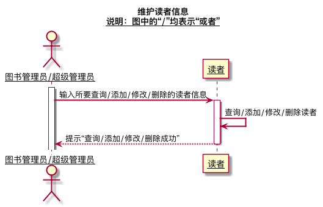

## 实验四（test3）：图书管理系统顺序图绘制
|学号|班级|姓名|
|:---------------:|:------------:|:------------:|
|201610414105|软件16-1|兰迪|
### 1.图书查询
#### 1.1图书查询的PlantUML代码
```
@startuml
title
 图书查询
 <u>说明：图中的“/”均表示“或者”</u>
end title
skinparam sequenceArrowThickness 2
skinparam maxmessagesize 60
skinparam sequenceParticipant underline
actor "游客/读者/图书管理员/超级管理员" as U
boundary "查询图书窗口" as A
database "数据库" as B
activate U
U ->A:输入图书信息
activate A
A ->B:获取对应图书信息
deactivate A
activate B
B ->U:返回图书信息
deactivate B
@enduml
```
#### 1.2图书查询顺序图

#### 1.3图书查询顺序图说明
1.参与者：actor：图书管理员/游客/超级管理员/读者 boundary:查询图书窗口 database:数据库<br>
2.消息：输入图书信息 -> 获取对应图书信息 -> 返回图书信息<br>

### 2.账户设置
#### 2.1账户查询的PlantUML代码
```
@startuml
title
 账户设置
 <u>说明：图中的“/”均表示“或者”</u>
end title
skinparam sequenceArrowThickness 2
skinparam maxmessagesize 60
skinparam sequenceParticipant underline
actor "读者/图书管理员/超级管理员" as U
boundary "账户设置窗口" as A
database "数据库" as B
activate U
activate A
U ->A:点击个人信息栏目
A ->U:显示个人信息
U ->A:点击并修改个人信息
A ->A:验证提交信息合法性
A ->B:更新信息
activate B
B ->A:更新成功
deactivate B
@enduml
```
#### 2.2账户设置顺序图


#### 1.3账户设置顺序图说明
1.参与者：actor：图书管理员/超级管理员/读者 boundary:账户设置窗口 database:数据库<br>
2.消息 点击个人信息栏目 -> 显示个人信息 -> 点击并修改个人信息 -> 验证提交信息合法性 -> 更新信息 -> 返回更新结果<br>

### 3.借出图书
#### 3.1借出图书的PlantUML代码
```
@startuml
title
 借出图书
 <u>说明：图中的“/”均表示“或者”</u>
end title
skinparam sequenceArrowThickness 2
skinparam maxmessagesize 60
skinparam sequenceParticipant underline
actor "图书管理员/超级管理员" as U
boundary "借书办理窗口   " as A
database "数据库" as B
collections "借书记录" as C
-> U:查阅将借阅的读书内容
activate U
activate A
U ->U:检查图书是否满足借阅条件
U ->A:输入读者信息
A ->B:查询读者信息
activate B
B -->A:返回读者信息
U ->A:判断是否符合借阅要求
A ->B:修改图书库存
B ->C:生成借书记录
activate C
C -->B:增加借阅信息
B -->A:返回操作结果
A -->U:返回借出结果
@enduml
```
#### 3.2借出图书顺序图


#### 3.3借出图书顺序图说明
1.参与者：actor：图书管理员/超级管理员 boundary:借书办理窗口 database:数据库 collections:借书记录<br>
2.消息 查阅将借阅的读书内容 -> 检查图书是否满足借阅条件 -> 输入读者信息 -> 查询读者信息 -> 返回读者信息 -> 判断是否满足借阅要求 -> 修改图书库存 -> 生成借书记录 -> 增加借阅信息 -> 返回操作结果 -> 返回借出结果<br>

### 4.归还图书
#### 4.1归还图书的PlantUML代码
```
@startuml
title
 归还图书
 <u>说明：图中的“/”均表示“或者”</u>
end title
skinparam sequenceArrowThickness 2
skinparam maxmessagesize 60
skinparam sequenceParticipant underline
actor "图书管理员/超级管理员" as U
boundary "还书办理窗口   " as A
collections "借书记录" as B
database "数据库" as C
-> U:检查书籍完整性
activate U
<-- U:登记赔偿
activate A
U ->A:输入读者信息
A ->B:查询借书记录
activate B
B -->A:返回借书记录
U ->U:查找对应借书记录，检查是否逾期
U ->A:确认还书
deactivate B
A ->C:修改图书库存
activate C
C -->A:返回操作结果
A ->B:修改借书记录
activate B
B ->C:删除对应借书记录
C -->B:返回操作结果
B -->A:返回操作结果
A -->U:返回归还结果

@enduml
```
#### 4.2借出图书顺序图


#### 4.3借出图书顺序图说明
1.参与者：actor：图书管理员/超级管理员 boundary:还书办理窗口 database:数据库 collections:借书记录<br>
2.消息 检查书籍完整性(如果书籍有破损，则进入登记赔偿) -> 输入读者信息 -> 查询借书记录 -> 返回借书记录 -> 查找对应借书记录，检查是否逾期 -> 确认还书 -> 修改图书库存 ->返回操作结果 -> 修改借书记录 -> 删除对应借书记录 -> 返回借出结果 -> 返回操作结果 -> 返回归还结果<br>

### 5.预定图书
#### 5.1预定图书的PlantUML代码
```
@startuml
title
 预定图书
 <u>说明：图中的“/”均表示“或者”</u>
end title
skinparam sequenceArrowThickness 2
skinparam maxmessagesize 60
skinparam sequenceParticipant underline
actor "读者" as U
boundary "预定图书办理窗口   " as A
collections "预定记录" as B
database "数据库" as C
activate U
activate A
U ->A:输入图书信息
A ->C:查询该图书信息
activate C
C -->A:返回图书信息
U ->A:确认预定
A ->B:添加预定记录
activate B
B ->C:添加对应预定记录
C -->B:返回操作结果
B -->A:返回操作结果
A -->U:返回预定结果

@enduml
```
#### 5.2预定图书顺序图


#### 5.3预定图书顺序图说明
1.参与者：actor：读者 boundary:预定图书办理窗口 collections:预定记录database:数据库<br>
2.消息 输入图书信息 -> 查询该图书信息 -> 返回图书信息 -> 确认预定 -> 添加预定记录 -> 添加对应预定记录 -> 返回操作结果 -> 返回借出结果 -> 返回预定结果<br>

### 6.取消预定
#### 6.1预定图书的PlantUML代码
```
@startuml
title
 取消预定
 <u>说明：图中的“/”均表示“或者”</u>
end title
skinparam sequenceArrowThickness 2
skinparam maxmessagesize 60
skinparam sequenceParticipant underline
actor "读者" as U
boundary "取消预定办理窗口   " as A
collections "预定记录" as B
database "数据库" as C
activate U
activate A
U ->A:查询预定图书信息
A ->B:查询预定记录
activate B
B -->A:返回预定记录
activate C
U ->A:确认取消预定
A ->B:删除对应书籍预定记录
B ->C:删除对应预定记录
C -->B:返回操作结果
B -->A:返回操作结果
A -->U:返回取消预定结果
@enduml
```
#### 6.2取消预定顺序图


#### 6.3预定图书顺序图说明
1.参与者：actor：读者 boundary:取消预定办理窗口 collections:预定记录database:数据库<br>
2.消息 查询预定图书信息 -> 查询预定记录 -> 返回预定记录 -> 删除对应书籍预定记录 -> 删除对应预定记录 -> 返回操作结果 -> 返回借出结果 -> 返回取消预定结果<br>

### 7.登记赔偿
#### 7.1登记赔偿的PlantUML代码
```
@startuml
title
 登记赔偿
 <u>说明：图中的“/”均表示“或者”</u>
end title
skinparam sequenceArrowThickness 2
skinparam maxmessagesize 60
skinparam sequenceParticipant underline
actor "图书管理员/超级管理员" as U
boundary "登记赔偿窗口   " as A
collections "罚款细则" as B
activate U
activate A
-> U:登记赔偿信息
U ->A:输入决策处理方法
A ->B:生成罚款细则
activate B
B -->A:返回操作结果
A -->U:返回赔偿结果
<-- U:归还图书
@enduml
```
#### 7.2登记赔偿顺序图


#### 7.3登记赔偿顺序图说明
1.参与者：actor：图书管理员/超级管理员 boundary:登记赔偿窗口 collections:罚款细则<br>
2.消息 登记赔偿信息 -> 输入决策处理方法 -> 生成罚款细则 -> 返回操作结果 ->  返回赔偿结果 -> 归还图书<br>

### 8.维护书目
#### 8.1维护书目的PlantUML代码
```
@startuml
title
 维护书目
 <u>说明：图中的“/”均表示“或者”</u>
end title
skinparam sequenceArrowThickness 2
skinparam maxmessagesize 60
skinparam sequenceParticipant underline
actor "图书管理员/超级管理员" as U
boundary "图书管理窗口" as A
database "数据库" as B
activate U
U ->A:输入要查询/添加/修改/删除的书目信息
activate A
A ->B:查询/添加/修改/删除相应书目
activate B
B -->A:返回相应操作结果
A -->U:返回相应操作结果
@enduml
```
#### 8.2维护书目顺序图


#### 8.3维护书目顺序图说明
1.参与者：actor：图书管理员/超级管理员 boundary:图书管理窗口 database:数据库<br>
2.消息 输入查询/添加/修改/删除的书目信息 -> 查询/添加/修改/删除相应书目 -> 返回相应操作结果 -> 返回相应操作结果<br>

### 9.维护读者信息
#### 9.1维护读者信息的PlantUML代码
```
@startuml
title
 维护读者信息
 <u>说明：图中的“/”均表示“或者”</u>
end title
skinparam sequenceArrowThickness 2
skinparam maxmessagesize 60
skinparam sequenceParticipant underline
actor "图书管理员/超级管理员" as U
boundary "读者信息管理窗口" as A
database "数据库" as B
activate U
U ->A:输入要查询/添加/修改/删除的读者信息
activate A
A ->B:查询/添加/修改/删除相应读者
activate B
B -->A:返回相应操作结果
A -->U:返回相应操作结果
@enduml

```
#### 9.2维护读者信息顺序图


#### 9.3维护读者信息顺序图说明
1.参与者：actor：图书管理员/超级管理员 boundary:读者信息管理窗口 database:数据库<br>
2.消息 输入查询/添加/修改/删除的读者信息 -> 查询/添加/修改/删除相应读者 -> 返回相应操作结果 -> 返回相应操作结果<br>

### 10.维护图书管理员信息
#### 10.1维护图书管理员信息的PlantUML代码
```
@startuml
title
 维护图书管理员信息
 <u>说明：图中的“/”均表示“或者”</u>
end title
skinparam sequenceArrowThickness 2
skinparam maxmessagesize 60
skinparam sequenceParticipant underline
actor "超级管理员" as U
boundary "图书管理员信息管理窗口" as A
database "数据库" as B
activate U
U ->A:输入要查询/添加/修改/删除的图书管理员信息
activate A
A ->B:查询/添加/修改/删除相应图书管理员
activate B
B -->A:返回相应操作结果
A -->U:返回相应操作结果
@enduml

```
#### 10.2维护图书管理员信息顺序图


#### 10.3维护图书管理员信息顺序图说明
1.参与者：actor：超级管理员 boundary:图书管理员信息管理窗口 database:数据库<br>
2.消息 输入查询/添加/修改/删除的图书管理员信息 -> 查询/添加/修改/删除相应图书管理员 -> 返回相应操作结果 -> 返回相应操作结果<br>


