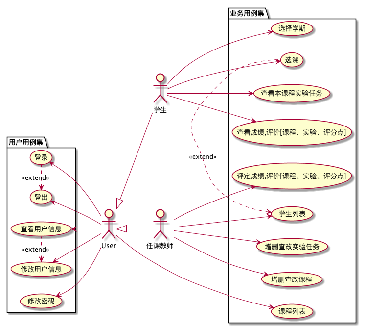
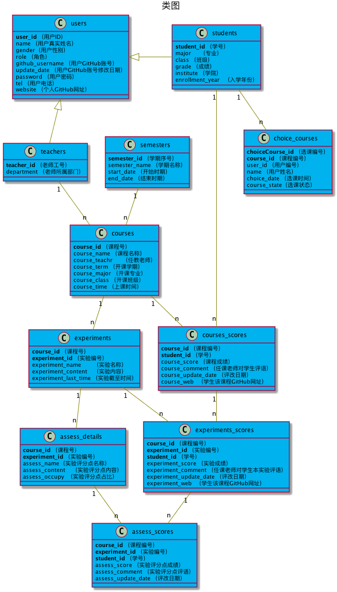

# (期末项目)基于GitHub的实验管理平台的分析与设计
|学号|班级|姓名|
|:---------------:|:------------:|:------------:|
|201610414105|软件16-1|兰迪|

## 一.概述
- 1.	基于GitHub的课程实验管理平台的作用是在线管理实验成绩的Web应用系统。学生和老师的实验内容均存放在GitHUB 页面上。
- 2.	学生的功能主要有：设置自己的GitHub用户名，查询自己的实验成绩，选择课程，查看和退选已选择的课程，学生的GitHub用户名是公开的，但成绩不公开。
- 3.	老师的功能主要有：除了学生的主要功能，增添课程，删除课程，查询课程，平定课程，增添实验，删除实验，查询实验，评定学生成绩。
- 4.	老师和学生都能通过本系统的链接方便地跳转到学生的每个GitHUB实验目录，以便批改实验或者查看实验情况。
- 5.	实验成绩按数字分数计算，每项实验的满分为100分，最低为0分。
- 6.	为了让老师更好的进行打分，老师可以提供评分点，提供的评分点占实验的百分之多少，然后来进行打分，这样更为准确。老师可以删除评分点，修改评分点，增加评分点，查看评分点，学生在查看实验时也能明白哪个部分是最为重要的。
- 7.	学生可以选课，但老师只能自己创建课程。

## 二.用例图设计[源码](./用例图.md)

- 说明
~~~
    1．user是为了方便表述用户基本功能,方便描述和文档操作抽象出来的角色
    2. 登出用例用来注销用户登录,注销后用户将不能进行其他用例除了登录外的操作
    3. 修改密码是学生,任课教师角色修改登录时凭证的方法
    4. 修改用户信息用来修改用户的信息，但是如同专业，学院等信息，用户不能修改。
    5. 课程列表是学生用来获取本学期所选课程,然后就能够通过点击各课程的链接跳转到该课程的实验列表进而再查看实验课程的详情或者提交课程实验等等
    6. 学生列表可以是老师用来获取所开课程所有学生信息进而进行课程实验批改成绩和查看学生的成绩等操作
    7. 增添加,编辑,和删除课程;增添加,编辑,和删除实验任务;增添加,编辑,和删除评分点是都属于教师的用例
~~~

## 三.类图[源码](./类图.md)

~~~
1. setter,getter方法被省略, 被继承属性省略
2. 类图及其来源说明:
        1. users 它是抽象的, 方便表述信息的抽象物
        2. students -使用/修改-> 用例: 用户基本功能用例集内全部,课程列表,选课等
        3. teachers -使用/修改-> 用例: 用户基本功能用例集内全部,学生列表,批改成绩,增删查改课程，增删查改评分点，增删查改实验任务等
        4. courses -增删改-> 用例: 对课程的相关等
        5. experiments -增删改-> 用例: 对课程实验的相关等
        6. semesters -使用-> 用例: 查询学期
        7. courses_scores -增查删改-> 用例: 对学生课程成绩的相关等
        8. experiments_scores -增查删改-> 用例: 对学生实验成绩的相关等 
        9. assess_details -增查删改-> 用例: 对课程实验评分点的相关等
        10. assess_scores -增查删改-> 用例: 对课程实验评分点的分数的相关等
        11. choice_courses-选择-> 用例: 学生选课的相关等
~~~

## 四.数据库设计
## [参见数据库设计](./数据库设计.md)

## 五. 界面及用例详细设计

### [“登录”用例](./用例/登录.md),[界面](https://landy7.github.io/is_analysis_pages/test6/index.html)
### [“登出”用例](./用例/登出.md),[界面](https://landy7.github.io/is_analysis_pages/test6/账户管理.html)
### [“修改密码”用例](./用例/修改密码.md),[界面](https://landy7.github.io/is_analysis_pages/test6/账户管理.html)
### [“查看用户信息”用例](./用例/查看用户信息.md),[界面](https://landy7.github.io/is_analysis_pages/test6/账户管理.html)
### [“修改用户信息”用例](./用例/修改用户信息.md),[界面](https://landy7.github.io/is_analysis_pages/test6/账户管理.html)
### [“选择学期”用例](./用例/选择学期.md),[界面](https://landy7.github.io/is_analysis_pages/test6/选择学期.html)
### [“课程列表”用例](./用例/课程列表.md),[学生界面](https://landy7.github.io/is_analysis_pages/test6/学生课程列表.html),[老师界面](https://landy7.github.io/is_analysis_pages/test6/老师课程列表.html)
### [“查看课程”用例](./用例/查看课程.md),[界面](https://landy7.github.io/is_analysis_pages/test6/形式与政策.html)
### [“查看实验任务”用例](./用例/查看实验任务.md),[界面]( https://landy7.github.io/is_analysis_pages/test6/实验任务.html)
### [“查看评分点”用例](./用例/查看评分点.md),[界面](https://landy7.github.io/is_analysis_pages/test6/评分点.html)
### [“查看成绩以及评价”用例](./用例/查看成绩以及评价.md),[界面](https://landy7.github.io/is_analysis_pages/test6/成绩单.html)
### [“选课”用例](./用例/选课.md),[界面](https://landy7.github.io/is_analysis_pages/test6/选课.html)
### [“学生列表”用例](./用例/学生列表.md),[界面](https://landy7.github.io/is_analysis_pages/test6/老师查询学生成绩.html)
### [“评定成绩”用例](./用例/评定成绩.md),[界面](https://landy7.github.io/is_analysis_pages/test6/成绩单.html)
### [“增加实验任务”用例](./用例/增加实验任务.md),[界面](https://landy7.github.io/is_analysis_pages/test6/添加实验.html)
### [“修改实验任务”用例](./用例/修改实验任务.md),[界面](https://landy7.github.io/is_analysis_pages/test6/实验任务.html)
### [“删除实验任务”用例](./用例/删除实验任务.md),[界面](https://landy7.github.io/is_analysis_pages/test6/实验任务.html)
### [“增加评分点”用例](./用例/增加评分点.md),[界面](https://landy7.github.io/is_analysis_pages/test6/添加评分点.html)
### [“修改评分点”用例](./用例/修改评分点.md),[界面](https://landy7.github.io/is_analysis_pages/test6/评分点.html)
### [“删除评分点”用例](./用例/删除评分点.md),[界面](https://landy7.github.io/is_analysis_pages/test6/评分点.html)
### [“修改课程”用例](./用例/修改课程.md),[界面](https://landy7.github.io/is_analysis_pages/test6/形式与政策.html)
### [“增加课程”用例](./用例/增加课程.md),[界面](https://landy7.github.io/is_analysis_pages/test6/添加课程.html)
### [“删除课程”用例](./用例/删除课程.md),[界面](https://landy7.github.io/is_analysis_pages/test6/形式与政策.html)

## 六. 参考文献
- 绘制方法参考[PlantUML标准](http://plantuml.com)
- Markdown格式参考：https://www.jianshu.com/p/b03a8d7b1719

